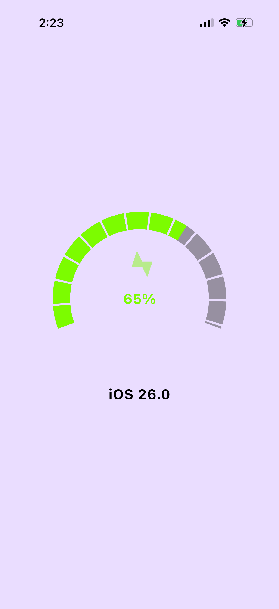

# ⚡🔋 KMP Battery Gauge

My first **Kotlin Multiplatform (KMP)** app built with **Jetpack Compose Multiplatform**.  
This app shows the **battery level** and **charging status** with a custom gauge UI that works on **Android, iOS, and Desktop**.

---

## ✨ Features
- 🔋 Cross-platform battery level detection (Android / iOS / Desktop).
- ⚡ Charging indicator with animated lightning bolt.
- 🎨 Custom **gauge UI**:
  - Segmented arc with crisp spacing.
  - Smooth color gradients (red → orange → green).
- 100% **Kotlin Multiplatform** — shared business logic across all platforms.

---

## 📱 Supported Platforms
- ✅ Android
- ✅ iOS
- ✅ Desktop (JVM / Compose Desktop)

---

## 🛠️ Tech Stack
- [Kotlin Multiplatform](https://kotlinlang.org/docs/multiplatform.html)
- [Jetpack Compose Multiplatform](https://www.jetbrains.com/lp/compose-multiplatform/)
- [OSHI](https://github.com/oshi/oshi) (for desktop system info)
- Swift/Objective-C interop (for iOS system info)
- Gradle Kotlin DSL

---

## 🚀 Getting Started

## 1. Clone the repo
git clone https://github.com/<your-username>/<repo-name>.git
cd <repo-name>


## Build and Run Android Application

To build and run the development version of the Android app, use the run configuration from the run widget
in your IDE’s toolbar or build it directly from the terminal:
- on macOS/Linux
  ```shell
  ./gradlew :composeApp:assembleDebug
  ```
- on Windows
  ```shell
  .\gradlew.bat :composeApp:assembleDebug
  ```

## Build and Run Desktop (JVM) Application

To build and run the development version of the desktop app, use the run configuration from the run widget
in your IDE’s toolbar or run it directly from the terminal:
- on macOS/Linux
  ```shell
  ./gradlew :composeApp:run
  ```
- on Windows
  ```shell
  .\gradlew.bat :composeApp:run
  ```

## Build and Run iOS Application

To build and run the development version of the iOS app, use the run configuration from the run widget
in your IDE’s toolbar or open the [/iosApp](./iosApp) directory in Xcode and run it from there.

---

## 📸 Screenshots

| Android                                        | iOS                                    | Desktop                                        |
|------------------------------------------------|----------------------------------------|------------------------------------------------|
|  |  |  |


Learn more about [Kotlin Multiplatform](https://www.jetbrains.com/help/kotlin-multiplatform-dev/get-started.html)…